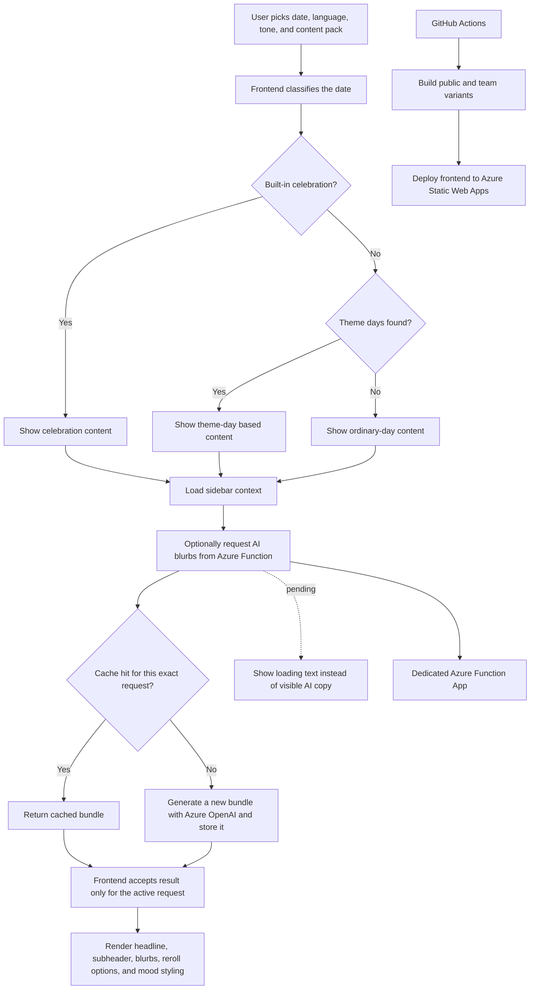

# Vad kan man fira?

`Vad kan man fira?` is a frontend-only React app that decides whether a Swedish
date deserves celebration, resignation, baked goods, or a dry remark about
calendar reality.

The shipped product lives in `fredagskoll-frontend` and is deployed to Azure
Static Web Apps from the `main` branch.

## Content packs

The app now supports two variants on top of the same shared core:

- `public`
  Default build. Uses the public `VKMF` branding and excludes the internal team
  weekday lore.
- `team`
  Keeps the private weekday celebrations such as `Köttonsdag`, `Fisktorsdag`,
  and `Marmeladfredag`, plus the `Mojo` team branding.

Set the variant with:

```sh
$env:REACT_APP_CONTENT_PACK="team"
```

If the variable is unset, the app defaults to `public`.

## Project structure

- `fredagskoll-frontend/src/App.tsx`
  Main composition layer for the UI.
- `fredagskoll-frontend/src/contentPack.ts`
  Content-pack selection, public/team boundaries, and recurring weekday rules.
- `fredagskoll-frontend/src/dayLogic.ts`
  Date classification and official Swedish holiday calculations.
- `fredagskoll-frontend/src/celebrations.ts`
  Built-in celebration content and pack-filtered exports.
- `fredagskoll-frontend/src/themeDaySpecificBlurbs.ts`
  Handwritten temadag overrides.
- `fredagskoll-frontend/src/themeDayCategoryBlurbs.ts`
  Category fallback blurbs for temadagar.
- `fredagskoll-frontend/src/data/temadagarByDate.json`
  Curated unofficial temadag dataset.
- `fredagskoll-frontend/public/images`
  Celebration images and source metadata.
- `api/blurbs`
  Azure Function endpoint for optional AI-generated blurb bundles.
- `api/shared`
  Request validation, prompt building, Azure OpenAI calling, and Table Storage cache logic.

## Application flow

See [docs/application-flow.md](docs/application-flow.md) for the full detailed
flow. The version below is the short, human-readable overview.



## Built-in celebration rules

Shared core:

- `allahjartansdag`: February 14
- `fettisdag`: calculated from Easter
- `paskafton`: calculated from Easter
- `vaffeldagen`: March 25
- `valborg`: April 30
- `nationaldagen`: June 6
- `midsommarafton`: Friday between June 19 and June 25
- `kanelbullensdag`: October 4
- `kladdkakansdag`: November 7
- `surstrommingspremiar`: third Thursday of August
- `lucia`: December 13
- `julafton`: December 24
- `nyarsafton`: December 31

Team pack only:

- `kottonsdag`: every Wednesday
- `fisktorsdag`: every Thursday
- `marmeladfredag`: every Friday

Ordinary days still pick up temadagar, seasonal notes, and other sidebar/context
logic as usual.

## Development

```sh
cd fredagskoll-frontend
npm install
npm start
```

Run the team edition locally:

```sh
$env:REACT_APP_CONTENT_PACK="team"
npm start
```

Useful checks:

```sh
npm test -- --runInBand --watchAll=false
npm run test:visual
npm run build
```

## Deployment

- GitHub Actions deploys the frontend from `main`
- `.github/workflows/deploy-static-apps.yml` builds the app twice:
  - `REACT_APP_CONTENT_PACK=public` deploys to `vadkanmanfira`
  - `REACT_APP_CONTENT_PACK=team` deploys to `fredagskoll`
- The workflow sets `REACT_APP_AI_API_BASE_URL=https://vkmf-blurbs-api.azurewebsites.net`
  for both builds
- Required GitHub Actions secrets:
  - `AZURE_STATIC_WEB_APPS_API_TOKEN_THANKFUL_BUSH_0D8565003_1`
  - `AZURE_STATIC_WEB_APPS_API_TOKEN_DELIGHTFUL_GROUND_0B3AA2B03`
- Azure Static Web Apps hosts both variants
- The AI backend is a separate Azure Function App at
  `https://vkmf-blurbs-api.azurewebsites.net`
- SPA routing fallback lives in
  `fredagskoll-frontend/public/staticwebapp.config.json`

## Optional AI blurbs

The app can now ask an Azure Function for generated blurb bundles. This is optional:
if the API is unavailable or Azure OpenAI is not configured, the frontend keeps using
the existing handwritten/static blurbs.

The frontend calls:

- `https://vkmf-blurbs-api.azurewebsites.net/api/blurbs`

What it does:

- receives a structured date context from the frontend
- computes a deterministic request hash
- checks a hot cache row in Azure Table Storage first
- rotates between multiple cached AI bundles for the same request when available
- refreshes stale bundles older than 15 minutes one slot at a time
- stores generated bundles in a separate bundle library table for reuse and tracking
- returns multiple options for:
  - `blurbs`
  - `titleEndings` for ordinary theme-day headlines
  - `cardNotes` for ordinary theme-day support text

Current table layout:

- `blurbcache`
  - one hot row per request key
  - stores request metadata, `useCount`, `lastUsedAt`, `lastBundleId`, and `bundleIdsJson`
- `blurblibrary`
  - one row per generated bundle
  - stores `bundleId`, `requestHash`, `generatedAt`, `model`, `useCount`, `lastUsedAt`,
    `titleEndingsJson`, `cardNotesJson`, and `blurbsJson`

Required Azure app settings for the dedicated Function App:

- `AZURE_OPENAI_ENDPOINT`
- `AZURE_OPENAI_API_KEY`
- `AZURE_OPENAI_DEPLOYMENT`
- `AZURE_OPENAI_API_VERSION`
- `AZURE_TABLES_CONNECTION_STRING`

Local sample config lives in:

- `api/local.settings.sample.json`

## Data and sources

- Official holiday calculations are maintained in code
- Namnsdag data is fetched from the open `sholiday` API at runtime
- Temadagar are curated into a local dataset inspired by `temadagar.se`
- Public image credits are exposed in the app for reused Wikimedia Commons
  assets
