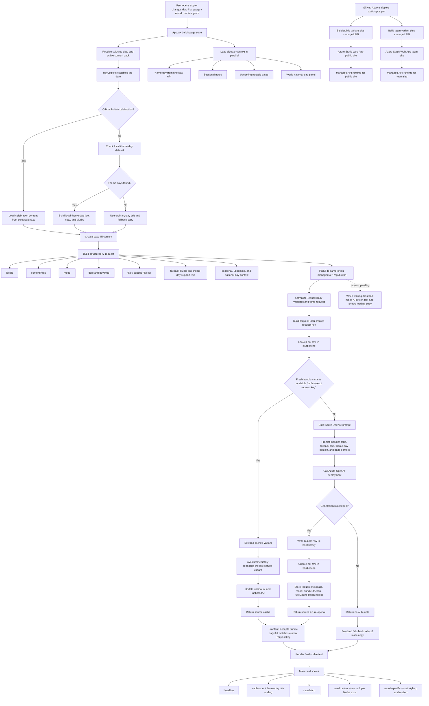

# Application Flow

This is the detailed Mermaid diagram for the end-to-end application flow. The
README keeps a shorter overview version.

```mermaid
flowchart TD
    A[User opens app or changes date / language / mood / content pack] --> B[App.tsx builds page state]
    B --> C[Resolve selected date and active content pack]
    C --> D[dayLogic.ts classifies the date]
    D --> E{Official built-in celebration?}
    E -->|Yes| F[Load celebration content from celebrations.ts]
    E -->|No| G[Check local theme-day dataset]

    G --> H{Theme days found?}
    H -->|Yes| I[Build local theme-day title, note, and blurbs]
    H -->|No| J[Use ordinary-day title and fallback copy]

    B --> K[Load sidebar context in parallel]
    K --> K1[Name day from sholiday API]
    K --> K2[Seasonal notes]
    K --> K3[Upcoming notable dates]
    K --> K4[World national-day panel]

    F --> L[Create base UI content]
    I --> L
    J --> L

    L --> M[Build structured AI request]
    M --> M1[locale]
    M --> M2[contentPack]
    M --> M3[mood]
    M --> M4[date and dayType]
    M --> M5[title / subtitle / kicker]
    M --> M6[fallback blurbs and theme-day support text]
    M --> M7[seasonal, upcoming, and national-day context]

    M --> N[POST to same-origin managed API /api/blurbs]
    N --> O[normalizeRequestBody validates and trims request]
    O --> P[buildRequestHash creates request key]
    P --> Q[Lookup hot row in blurbcache]

    Q --> R{Fresh bundle variants available for this exact request key?}
    R -->|Yes| S[Select a cached variant]
    S --> S1[Avoid immediately repeating the last-served variant]
    S1 --> S2[Update useCount and lastUsedAt]
    S2 --> T[Return source cache]

    R -->|No| U[Build Azure OpenAI prompt]
    U --> U1[Prompt includes tone, fallback text, theme-day context, and page context]
    U1 --> V[Call Azure OpenAI deployment]
    V --> W{Generation succeeded?}

    W -->|Yes| X[Write bundle row to blurblibrary]
    X --> Y[Update hot row in blurbcache]
    Y --> Y1[Store request metadata, mood, bundleIdsJson, useCount, lastBundleId]
    Y1 --> Z[Return source azure-openai]

    W -->|No| AA[Return no AI bundle]

    T --> AB[Frontend accepts bundle only if it matches current request key]
    Z --> AB
    AA --> AC[Frontend falls back to local static copy]

    AB --> AD[Render final visible text]
    AC --> AD

    AD --> AE[Main card shows]
    AE --> AE1[headline]
    AE --> AE2[subheader / theme-day title ending]
    AE --> AE3[main blurb]
    AE --> AE4[reroll button when multiple blurbs exist]
    AE --> AE5[mood-specific visual styling and motion]

    N -. request pending .-> AF[While waiting, frontend hides AI-driven text and shows loading copy]

    AG[GitHub Actions deploy-static-apps.yml] --> AH[Build public variant plus managed API]
    AG --> AI[Build team variant plus managed API]
    AH --> AJ[Azure Static Web App public site]
    AI --> AK[Azure Static Web App team site]
    AJ --> AL[Managed API runtime for public site]
    AK --> AM[Managed API runtime for team site]
```
